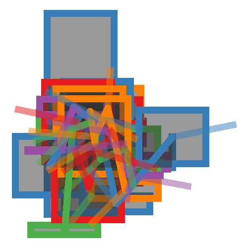
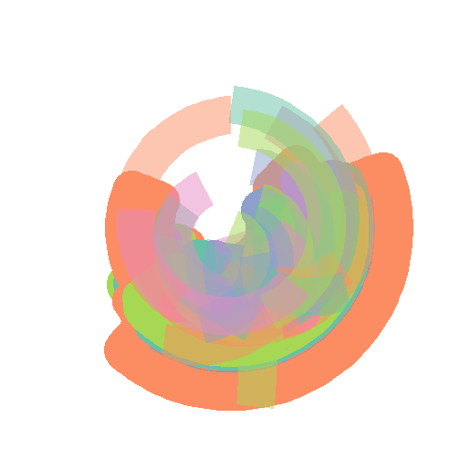

# Generative Art Using R
## Create the data set
There is a great potential for creating digital art by using R’s ggplot2 library and create visualizations that look like real art works. Mainly those approaches use data sets which are based on mathematical formulas and can be manipulated as desired. 
My approach of creating digital art using R is quite similar. First I created a data set that is based on three random variables “X”, “Y” and “Z” and one grouping variable “Group”. These distributions are based on a normal distribution with a given mean and standard deviation.


```r
generate_data <- function(N,ngroup,xmean,xvar,ymean,yvar,zmean,zvar){
   DAT=data.frame()

  names=paste("G_",seq(1,ngroup),sep="")
  DAT=data.frame()
  for(i in seq(1:ngroup)){
      data=data.frame( matrix(0, ngroup , 4))
      data[,1]=sample(names, nrow(data))
      data[,2]=sample( c(rnorm(N,mean = xmean,sd = xvar),c(1:ngroup)) ,nrow(data))
      data[,3]=sample( c(rnorm(N,mean=ymean,sd = yvar),c(1:ngroup)) ,nrow(data))
      data[,4]=sample( c(rnorm(N,mean=zmean,sd = zvar),c(1:ngroup)) ,nrow(data))
      DAT=rbind(DAT,data)
  }
  colnames(DAT)=c("Group","X","Y","Z")
  DAT
}
gendata <- generate_data(1050,5,1,2,3,4,5,6)
head(gendata)
```

```
##   Group          X          Y          Z
## 1   G_2  5.3371827 10.6559562  8.5136840
## 2   G_4  1.7976104  0.9549612 -0.6911665
## 3   G_1  1.1728894  7.5681342 -9.1414875
## 4   G_5 -0.9805761  3.5770292  9.2086493
## 5   G_3  2.0231267  3.0556441 11.9368353
## 6   G_5 -2.6900639  7.9296991 10.3481377
```

## Create the plot
Using this data one can now plot an “art work”. I was trying to find attributes that would make the art works look quite different, but that can later also been used to find out which kind of art is preferred by the user. The attributes are the following:

1. N (Number of samples)
2. ngroups (Number of different groups)
3. xmean, ymean, zmean (means of the distributions)
4. xsd, ysd, zsd (standard deviations of the distributions)


5. geom (what kind of geometric is used in the art work)
6. alpha (opacity value)
7. polar (using polar coordinate system)
8. size (size of the geometric objects)
9. ncolor (number of different colors)
11. colorscale (which color scale is being used)

To find these attributes I was playing around with the outcome a bit, and it seemed that these attributes create various different visualizations. Some of these visualizations looked rather boring to me and some I enjoyed looking at. These visualizations will be used for the recommendation in the next step.


```r
generate_plot <- function(DAT,colorscale="Set1",col=T,tile=T,area=T,point=T,line=T,spoke=T,size=5,alpha=0.5,polar=F){

  p <- ggplot() +
    
    scale_color_brewer(palette = colorscale) +
    scale_fill_brewer(palette = colorscale) +
    #geom_col()+
    #theme_bw()# +
    theme(
      line = element_blank(),
      text = element_blank(),
      title = element_blank(),
      legend.position = "none",
      panel.border = element_blank(),
      panel.background = element_blank()
    )
  
  
  if (col) {
    p <- p + geom_col(
      aes(
        x = X,
        y = Y,
        color = Group,
        group = Group
      ),
      size = size,
      alpha = alpha,
      data = DAT
    )
  }
  if(tile){
      p <- p+geom_tile( aes(x=X,
                            y=Y,
                            height = Z,

                            color=Group,
                            group=Group,
                            width=size
      ), size=size,
      alpha=alpha,data = DAT)
  }
  # if(boxplot){
  #    p <- p+geom_boxplot( aes(x=X,
  #                             y=Y,
  # 
  #                             color=Group,
  #                             group=Group
  #    ), size=size,
  #    alpha=alpha,data = DAT)
  # }
  # if(violin){
  #   p <- p+geom_violin( aes(x=Group,
  #                           y=Y,
  # 
  #                           color=Group
  #   ),  size=size,
  #   alpha=alpha,data = DAT)
  # }

  if(area){
      p <- p+geom_area( aes(x=X,
                            y = Y,

                            color=Group,
                            group=Group
      ), size=size,alpha=alpha,data = DAT)
  }

  if(point){
      p <- p+geom_point( aes(x=X,
                             y=Y,

                             color=Group
      ),size=size,
      alpha=alpha,data = DAT)
  }

  if(line){
      p <- p+geom_line( aes(x=X,
                            y=Y,
                            z=Z,

                            color=Group,
                            group=Group
      ), size=size,
      alpha=alpha,data = DAT)
  }
  if(spoke){
      p <- p+geom_spoke( aes(x=X,y=Y,angle=Z,color=Group
      ),
      alpha=alpha,radius=size,size=size,data = DAT)
  }

  
  
  if(polar==T){
      p <- p+coord_polar()
  }
  p
    
}
generate_plot(gendata)
```

```
## Warning: Ignoring unknown aesthetics: z
```



Below the same function is called, but this time with different parameters.


```r
gendata
```

```
##    Group           X          Y          Z
## 1    G_2  5.33718272 10.6559562  8.5136840
## 2    G_4  1.79761040  0.9549612 -0.6911665
## 3    G_1  1.17288942  7.5681342 -9.1414875
## 4    G_5 -0.98057608  3.5770292  9.2086493
## 5    G_3  2.02312670  3.0556441 11.9368353
## 6    G_5 -2.69006393  7.9296991 10.3481377
## 7    G_1  0.17287909  0.4114346 -0.7328689
## 8    G_2  2.46745993  7.4565076 10.1068925
## 9    G_4  4.46989581 10.3052623  3.0626408
## 10   G_3  1.69282154  5.5476049  7.4420439
## 11   G_3  2.19830229  6.4860245  9.5725504
## 12   G_1  1.43545311  4.0186799  3.1256093
## 13   G_4  1.18172416  0.3370981  6.4013600
## 14   G_2 -1.80914593 -4.7825175 13.3955558
## 15   G_5  0.52687584  3.8766069 11.9133755
## 16   G_3 -0.21689016 -1.3878580 -2.2429813
## 17   G_2 -1.42524266 -0.1474756 -2.2675076
## 18   G_4  3.41002480  0.7808506  1.0926678
## 19   G_1  0.84529937  2.0679781 -3.9083902
## 20   G_5  0.06031314 -1.0498293  8.3780060
## 21   G_5  0.26746736  8.4711937 -0.2193866
## 22   G_4 -1.01094838  5.1815431 10.1975640
## 23   G_1  0.85995863  9.4244539 -0.3297125
## 24   G_3 -1.09388976  0.8949540  5.1246579
## 25   G_2  0.14817196  7.4075179  5.3113974
```

```r
generate_plot(gendata,colorscale = "Set2",size = 15,polar = T)
```

```
## Warning: Ignoring unknown aesthetics: z
```




## Create various configurations
For creating various different visualizations I created a function that will create random configurations of the attributes.


```r
generate_config <- function(NPOP){
  data.frame(
    list(
      id = seq(1, NPOP),
      ngroups = sample(2:30, NPOP, replace = T),
      N = sample(150:1500, NPOP, replace = T),
      xmean = sample(1:5, NPOP, replace = T),
      ymean = sample(1:5, NPOP, replace = T),
      zmean = sample(1:5, NPOP, replace = T),
      xvar = sample(1:50, NPOP, replace = T),
      yvar = sample(1:50, NPOP, replace = T),
      zvar = sample(1:50, NPOP, replace = T),
      col = sample(c(T,F),NPOP,replace=T),
      tile = sample(c(T,F),NPOP,replace=T),
      boxplot= sample(c(T,F),NPOP,replace=T),
      violin= sample(c(T,F),NPOP,replace=T),
      area= sample(c(T,F),NPOP,replace=T),
      point= sample(c(T,F),NPOP,replace=T),
      spoke= sample(c(T,F),NPOP,replace=T),
      line = sample(c(T,F),NPOP,replace=T),
      
      polar = sample(c(T, F), NPOP, replace = T),
      size = sample(seq(1, 100, 1), NPOP, replace = T),
      alpha = runif(NPOP, 0, 1),
      ncolor = sample(2:8, NPOP, replace = T),
      colorscale = sample(
        c(
          "Set1",
          "Set2",
          "Set3",
          "Pastel1",
          "Pastel2",
          "Paired",
          "Dark2",
          "Accent",
          "Blues",
          "Greys",
          "BuGn",
          "Reds",
          "Oranges",
          "Greens"
        ),
        NPOP,
        replace = T
      ),
      score = rep(NA, NPOP),
      pred_score = rep(NA, NPOP),
      rated = rep(F, NPOP)
    )
  )
}
generate_config(10)
```

```
##    id ngroups    N xmean ymean zmean xvar yvar zvar   col  tile boxplot violin  area point spoke  line polar size      alpha ncolor colorscale score
## 1   1       9  382     3     5     5   25    9   45  TRUE  TRUE   FALSE   TRUE  TRUE  TRUE  TRUE FALSE FALSE   33 0.78799961      7     Accent    NA
## 2   2      23 1061     1     3     5    6   13   49  TRUE  TRUE   FALSE   TRUE  TRUE  TRUE  TRUE FALSE  TRUE   44 0.41624284      6     Greens    NA
## 3   3       8  600     3     3     5   36   13    8 FALSE  TRUE   FALSE   TRUE FALSE FALSE FALSE  TRUE  TRUE   21 0.24689227      7       Reds    NA
## 4   4       3 1309     3     3     2   41   35   14  TRUE  TRUE    TRUE  FALSE FALSE FALSE  TRUE  TRUE FALSE   38 0.35872706      2      Greys    NA
## 5   5      14 1427     3     5     4   33   39   33 FALSE FALSE    TRUE  FALSE FALSE FALSE  TRUE FALSE  TRUE   60 0.04521455      6     Greens    NA
## 6   6      28 1430     2     5     5   31   50   39  TRUE  TRUE   FALSE  FALSE FALSE  TRUE  TRUE  TRUE  TRUE   53 0.75491358      5      Dark2    NA
## 7   7      26  528     5     4     1   28   46   50 FALSE FALSE    TRUE  FALSE FALSE FALSE FALSE  TRUE  TRUE   25 0.65712413      5    Pastel1    NA
## 8   8      17  276     3     2     5   39   49   34  TRUE FALSE   FALSE  FALSE  TRUE  TRUE  TRUE  TRUE FALSE   82 0.32238938      6       BuGn    NA
## 9   9       3  903     5     5     2   25   18   44 FALSE FALSE   FALSE  FALSE  TRUE  TRUE  TRUE  TRUE FALSE   45 0.09305135      8    Pastel2    NA
## 10 10       4  878     1     5     2   20   29   21  TRUE  TRUE   FALSE  FALSE FALSE FALSE  TRUE FALSE FALSE   69 0.67945568      5    Pastel2    NA
##    pred_score rated
## 1          NA FALSE
## 2          NA FALSE
## 3          NA FALSE
## 4          NA FALSE
## 5          NA FALSE
## 6          NA FALSE
## 7          NA FALSE
## 8          NA FALSE
## 9          NA FALSE
## 10         NA FALSE
```
